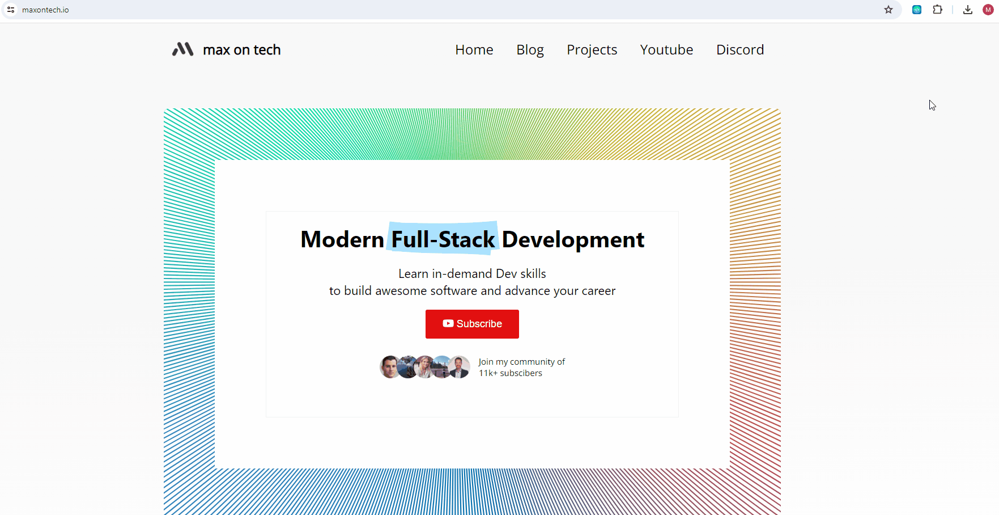

<!-- omit in toc -->
# Outline HTML Elements

 
 

##### Outline HTML elements with a colorful border without affecting the layout to inspect the structure of websites.

👉 Currently pending review on Chrome store.

Made by [maxontech](https://twitter.com/max_on_tech)

<!-- omit in toc -->
## Table of contents

- [Features](#features)
- [Opening the Extension](#opening-the-extension)
- [Installing locally on Chrome](#installing-locally-on-chrome)
- [Libraries](#libraries)
- [Contact](#contact)

## Features

List of features:
- 📐 **Outline HTML elements**: Press and hold the keybind to show the outline of HTML elements.
- ⚙️ **Customizable keybind**: You can configure the keybind in the extensions menu.
- 🎨 **Choose outline colors**: Choose the outline color for each HTML element individually.
- 🔄 **No layout changes**: The extension will not affect the layout of the website.
- 👍 **Lightweight**: The extension is lightweight and does not affect the performance of the browser.
- 📖 **Open-source**: The extension is open-source and free to use.
- 🚫 **No tracking**: The extension does not track any user data.
- 📺 **No ads**: The extension is free of ads.
- 📡 **No internet connection required**: The extension works offline.

## Opening the Extension

Simply install the extension from the Chrome Webstore or locally (as described below).
Afterwards, you can press and hold the keybind ctrl + b to show the outline of HTML elements.

The outlines will show for as long as the configured keybind is pressed. You can configure 
the keybind in the extensions menu.

## Installing locally on Chrome
You can run the extension locally without having to install it from the Chrome Store.

1. Download the code. In the web version of GitHub, you can do that by clicking the green "Code" button, and then "Download ZIP".
2. Go to chrome://extensions/ in your browser, and [enable developer mode](https://developer.chrome.com/docs/extensions/mv2/faq/#:~:text=You%20can%20start%20by%20turning,a%20packaged%20extension%2C%20and%20more.).
3. Drag the [main folder](https://github.com/maxontech/twitter-font-editor/tree/master/main) (make sure it's a folder and not a ZIP file, so unzip first), or click on the "Load unpacked" button and locate the folder.
4. That's it, you will now be able to use the extension locally.

## Libraries

- [jQuery](https://jquery.com/) - for better event handling and DOM manipulation

## Contact

Feel free to reach out to me [on Twitter](https://twitter.com/max_on_tech) if you have any questions or feedback! Hope you find this useful!
